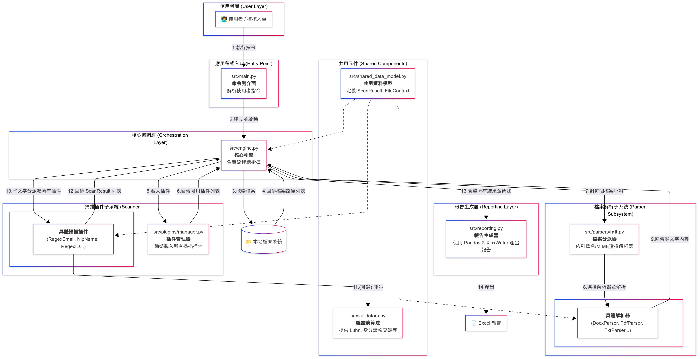

# ROCPII Tool


一個可擴展的白箱網頁個資掃描引擎，預設掃描項目依據「113 年共同供應契約資通安全服務品項採購規範」規定的網頁個資檢測項目，並採用「混合式掃描策略」，結合正規表示式與 NLP 技術，可解析多種檔案格式並產出 Excel 稽核報告。

---

## **目錄**

* [**1. 專案概述**](#1-專案概述)
* [**2. 核心功能**](#2-核心功能)
* [**3. 技術棧**](#3-技術棧)
* [**4. 安裝與設定**](#4-安裝與設定)
* [**5. 使用方法**](#5-使用方法)
* [**6. 擴充掃描器**](#6-擴充掃描器)
* [**7. 已知限制**](#7-已知限制)

---

## **1. 專案概述**

ROCPII Tool 是一個可擴展的白箱網頁個資掃描引擎，採用「混合式掃描策略」：
- **正規表示式 (Regex)**：快速檢測固定格式的個資，例如身分證號、電話、Email。
- **自然語言處理 (NLP)**：利用 `ckiplab/bert-base-chinese-ner` 模型識別上下文中的人名等非結構化個資。

支援多種檔案格式的深度解析，並產出 Excel 報告，方便稽核人員檢視與分析。

---

## **2. 核心功能**

* **多格式檔案解析**  
  支援 Microsoft Office (.docx, .doc, .xlsx, .xls)、PDF 以及各類文字型網頁檔 (.html, .css, .js, .json, .xml)。

* **插件化掃描引擎**  
  個資掃描邏輯（如身分證、信用卡、姓名）皆以獨立插件實作，易於維護與擴充。

* **混合式掃描策略**  
  - **Regex**：結合上下文關鍵字與驗證演算法，針對固定格式個資進行高速掃描。  
  - **NLP**：透過 NER 模型辨識非結構化資料中的個資。

* **智慧型信賴度評分**（參考用）  
  為每筆個資提供 0.0–1.0 的信賴分數，報告中以顏色標示風險等級。

* **Excel 報告輸出**  
  自動生成具篩選器、凍結窗格、條件格式化的 Excel 分析報告。

---

## **3. 技術棧**

| 類別          | 工具與套件 |
| ------------- | -------- |
| **核心語言** | Python 3.9+ |
| **CLI** | argparse |
| **檔案解析** | python-magic, python-docx, pywin32, openpyxl, xlrd, PyMuPDF, beautifulsoup4, lxml |
| **掃描引擎** | re (Regex), transformers, torch |
| **報告生成** | pandas, XlsxWriter |

---

## **4. 安裝與設定**

### **先決條件**
- Python 3.9 或更高版本（建議使用 3.12.1）

### **安裝步驟**

1. **建立並啟用虛擬環境**（強烈建議）
    ```bash
    # 建立虛擬環境
    python -m venv .venv

    # 啟用虛擬環境 (Windows)
    .\venv\Scripts\activate

    # 啟用虛擬環境 (macOS / Linux)
    source venv/bin/activate
    ```

2. **建立 requirements.txt**
    ```txt
    # Document handling
    python-docx==1.2.0
    openpyxl==3.1.5
    PyMuPDF==1.26.3
    XlsxWriter==3.2.5
    
    # Machine Learning
    transformers==4.55.0
    torch==2.8.0
    
    # File type detection
    python-magic-bin==0.4.14
    
    # Data manipulation and progress bar
    pandas==2.3.1
    tqdm==4.67.1
    ```

3. **安裝依賴套件**
    ```bash
    pip install -r requirements.txt
    ```
    ```
    python -m src.main ./sensitive_data -o scan_report.xlsx
    ```
---

## **5. 使用方法**

所有操作皆透過命令列執行。

**基本指令**
```bash
python -m src.main <要掃描的目錄或檔案路徑> [其他選項]
```
**範例**

```bash
python -m src.main ./sensitive_data -o scan_report.xlsx --force
```
**命令列參數**

|參數            |縮寫       |說明        |
| ------------- | -------- | --------- |
|scan_path	|無	|必要：掃描目標檔案或資料夾路徑|
|--output	|-o	|指定輸出 Excel 檔案名稱|
|--log-level	|-l	|日誌等級：DEBUG, INFO, WARNING, ERROR|
|--plugins	|-p	|僅啟用指定插件（空格分隔）|
|--workers	|-w	|平行處理的進程數（預設為 CPU 核心數）|
|--force	|-f	|覆寫已存在的輸出檔案|
|--version	|-v	|顯示版本號|
|--help	|-h	|顯示工具使用說明|

## **6. 擴充掃描器**
ROCPII Tool 採用插件化架構，新增個資掃描項目流程如下：

**分析需求**：確定個資格式與是否需要驗證演算法。

**實作驗證器（可選）**：在 src/validators.py 新增驗證函式。

**建立插件檔案**：於 src/plugins/ 新增 xxx_scanner.py。

**撰寫插件類別**：

```python
from src.plugins.base import ScannerPlugin

class MyScanner(ScannerPlugin):
    pii_type: ClassVar[str] = "個資類型"

    def scan(self, text: str, file_context: FileContext) -> ScanReport:
        # 核心掃描邏輯
        pass
```
完成：PluginManager 會在下次啟動時自動載入新插件。

## **7. 已知限制**
**首次執行**：會自動下載 NLP 模型（約 400MB），需數分鐘。

**NLP 與 Regex 準確率**：對特殊格式地址辨識率可能不足。

**加密檔案**：無法解析受密碼保護的 Office 或 PDF 檔案。

**正確性**：此工具產出的結果僅供參考，不保證 100% 準確，請以實際網頁中的內容為準。

## **8. 設計架構**

